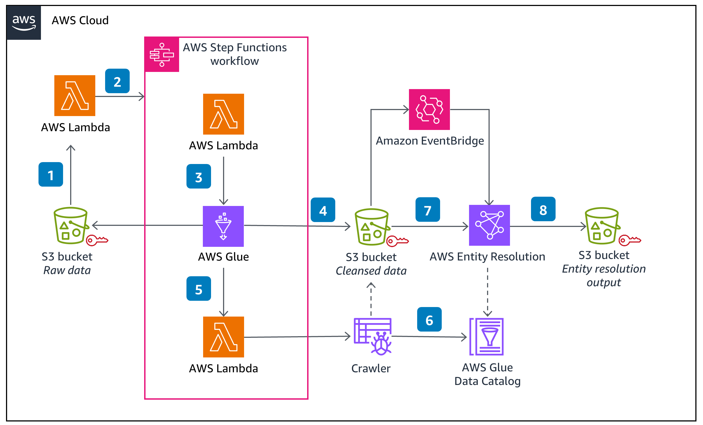

## Introduction

### What is this repository about?

This repository contains Java based code to apply normalization rules on data in Amazon S3. These normalization rules support offline PII entity types such as, name, address, email and phone. 

* a Java based normalization rules library
* a sample AWS Glue ETL job that applies the normalization rules on input source data in Amazon S3
* a sample data file that is uploaded to the Amazon S3 bucket (created as part of this deployment) that serves as the input source data
* a CDK based deployment script to deploy the sample code in your AWS account

## Prerequisites

In order to build this solution on your local environment, you will need to have these prerequisites:

* [Node.js](https://nodejs.org/en/) with version higher than 10.13.0 (Please note that version between 13.0.0 and 13.6.0 are not compatible too)
* JDK 1.8 or higher
* [Maven](https://maven.apache.org/download.cgi) with version higher than 3.8.2
* [CDK](https://docs.aws.amazon.com/cdk/v2/guide/getting_started.html#getting_started_prerequisites) with version <b>2.83.1</b> or higher
* an AWS Account with a granted permission to deploy CloudFormation stacks.

## Design



## Installation

### Boostrap the environment (optional)

The project code requires that the AWS account is [bootstrapped](https://docs.aws.amazon.com/cdk/v2/guide/bootstrapping.html) to allow the deployment of the CDK stack. You may do so by running the following command:

~~~
cdk bootstrap
~~~


### Compile the Java based normalization library
Run the following commands to compile the normalization library
~~~
#navigate to the source folder
cd guidance-for-customizing-normalization-library-for-aws-entity-resolution 

#compile the project using maven
mvn clean package
~~~


### Deploying the solution

You can deploy this solution in your AWS Account via the CDK scripts provided.
> Note - In case your local machine is not configured to communicate with your AWS account, please follow the instructions [here](https://docs.aws.amazon.com/cli/latest/userguide/cli-authentication-short-term.html).
~~~
#navigate to the source folder (if you are already in the source folder you can skip this command)
cd guidance-for-customizing-normalization-library-for-aws-entity-resolution

#install all the module dependencies
npm install
npm install cdk-nag

#bootstrap the cdk environment (if your environment is not bootstraped)
cdk bootstrap

#deploy the stack you want
cdk list (lists the stack names)
cdk deploy {stack name} --require-approval never
~~~

## Run the solution

Now that your stack is deployed, follow the applicable instructions to run the solution:
- [Normalization](README_NORMALIZATION.md)
- [Address Validation](README_ADDRESS_VALIDATION.md)

## Cleanup

Run the following command to delete the stack from your Account.

```
cdk destroy
```

Once the stack has been deleted successfully, you may delete the input and output Amazon S3 buckets manually by visiting the AWS S3 Console page.   
