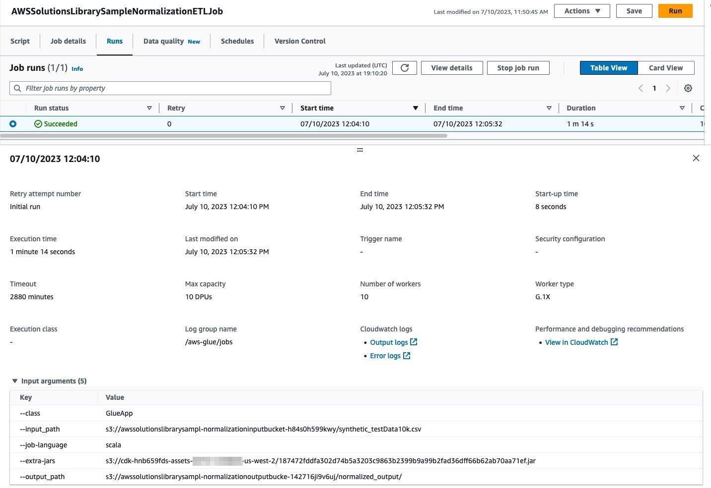

## Introduction

### What is this repository about?

This repository contains Java based code to apply normalization rules on data in Amazon S3. These normalization rules support offline PII entity types such as, name, address, email and phone. 

* a Java based normalization rules library
* a sample AWS Glue ETL job that applies the normalization rules on input source data in Amazon S3
* a sample data file that is uploaded to the Amazon S3 bucket (created as part of this deployment) that serves as the input source data
* a CDK based deployment script to deploy the sample code in your AWS account

## Prerequisites

In order to build this solution on your local environment, you will need to have these prerequisites:

* [Node.js](https://nodejs.org/en/) with version higher than 10.13.0 (Please note that version between 13.0.0 and 13.6.0 are not compatible too)
* JDK 1.8 or higher
* [Maven](https://maven.apache.org/download.cgi) with version higher than 3.8.2
* [CDK](https://docs.aws.amazon.com/cdk/v2/guide/getting_started.html#getting_started_prerequisites) with version <b>2.83.1</b> or higher
* an AWS Account with a granted permission to deploy CloudFormation stacks.

## Design


## Installation

### Boostrap the environment (optional)

The project code requires that the AWS account is [bootstrapped](https://docs.aws.amazon.com/cdk/v2/guide/bootstrapping.html) to allow the deployment of the CDK stack. You may do so by running the following command:

~~~
cdk bootstrap
~~~


### Compile the Java based normalization library
Run the following commands to compile the normalization library
~~~
#navigate to the source folder
cd guidance-for-cleansing-data-using-open-source-normalization-rules-on-aws

#compile the project using maven
mvn clean package
~~~


### Deploying the solution

You can deploy this solution in your AWS Account via the CDK scripts provided.
> Note - In case your local machine is not configured to communicate with your AWS account, please follow the instructions [here](https://docs.aws.amazon.com/cli/latest/userguide/cli-authentication-short-term.html).
~~~
#navigate to the source folder (if you are already in the source folder you can skip this command)
cd guidance-for-cleansing-data-using-open-source-normalization-rules-on-aws

#install all the module dependencies
npm install
npm install cdk-nag

#bootstrap the cdk environment (if your environment is not bootstraped)
cdk bootstrap

#deploy the stack
cdk deploy --require-approval never
~~~

After deploying the Kit, continue with [Run the solution](#run-the-solution).


## Run the solution

Once the stack is successfully created, an AWS Glue ETL job is created.
1. Login into the AWS Console
2. Navigate to [AWS Glue Studio ETL Jobs](https://us-west-2.console.aws.amazon.com/gluestudio/home)
3. Click on the Glue job named ***AwsSolutionsFirstPartyDataNormalizationETLJob***
4. Navigate to the **Runs** tab
5. Click on **Run**

This will initiate a new run of the job.
>Note - the job will fail if the Amazon S3 output location already exists. In such a case, delete the output location in the Amazon S3 bucket and re-run the job.
> <br>The output location can be found as an output of the CloudFormation Stack  

Once the job completes successfully, the normalized data is written to the output Amazon S3 bucket with additional columns representing the normalized values.




##Output from the CDK deployment

The CDK script publishes the input and output Amazon S3 bucket locations.

inputdatapath - the Amazon S3 bucket that holds the input sample data

gluenormalizedoutputpath - the Amazon S3 bucket that holds the output data written by the AWS Glue ETL job 


## Customize the solution

### Customize input data and attributes for normalization
1. The AWS Glue ETL job accepts a S3 uri of the input data as an argument. Replace the value of this argument with your input data S3 path
2. The script normalizes offline PII identifiers. This can be changed/updated as per the input dataset. Modify the ***script.scala*** code appropriately

### Add support for additional entity types
To add support for additional entity types, the following areas need to be updated:
1. normalizeRules.json - add the new entity type and associated rules
2. NormalizeModel.java - add the enums for associated changes done to the normalizeRules.json file
3. CustomerRecord.java - add the new entity type
4. Normalizer.java - add normalize method for the new entity type and update the normalizeRecord method for the new entity type
5. Operations.java - add the logic to apply normalization rules for the new entity type 


## Cleanup

Run the following command to delete the stack from your Account.

```
cdk destroy
```

Once the stack has been deleted successfully, you may delete the input and output Amazon S3 buckets manually by visiting the AWS S3 Console oage.   