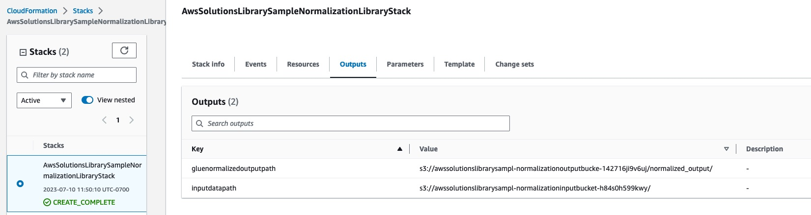

## Before Starting
Make sure to follow the instructions in the [top-level README](README.md) before doing Normalization.

## Run the solution

Once the stack is successfully created, an AWS Glue ETL job is created.
1. Login into the AWS Console
2. Navigate to [AWS Glue Studio ETL Jobs](https://us-west-2.console.aws.amazon.com/gluestudio/home) appropriate to your AWS region
3. Click on the Glue job named ***AWSSolutionsLibrarySampleNormalizationETLJob***
4. Navigate to the **Runs** tab
5. Click on **Run**

This will initiate a new run of the job.
>Note - the job will fail if the Amazon S3 output location already exists. In such a case, delete the output location in the Amazon S3 bucket and re-run the job.
>  The output location can be found as an output of the CloudFormation Stack

Once the job completes successfully, the normalized data is written to the output Amazon S3 bucket with additional columns representing the normalized values.

##Output from the CDK deployment

The CDK script publishes the input and output Amazon S3 bucket locations.

inputdatapath - the Amazon S3 bucket that holds the input sample data

gluenormalizedoutputpath - the Amazon S3 bucket that holds the output data written by the AWS Glue ETL job

## Customize the solution

### Customize input data and attributes for normalization
1. The AWS Glue ETL job accepts a S3 uri of the input data as an argument. Replace the value of this argument with your input data S3 path
2. The script normalizes offline PII identifiers. This can be changed/updated as per the input dataset. Modify the ***script.scala*** code appropriately

### Add support for additional entity types
To add support for additional entity types, the following areas need to be updated:
1. normalizeRules.json - add the new entity type and associated rules
2. NormalizeModel.java - add the enums for associated changes done to the normalizeRules.json file
3. CustomerRecord.java - add the new entity type
4. Normalizer.java - add normalize method for the new entity type and update the normalizeRecord method for the new entity type
5. Operations.java - add the logic to apply normalization rules for the new entity type